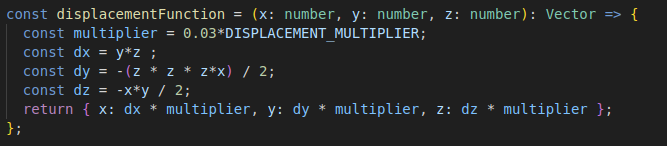
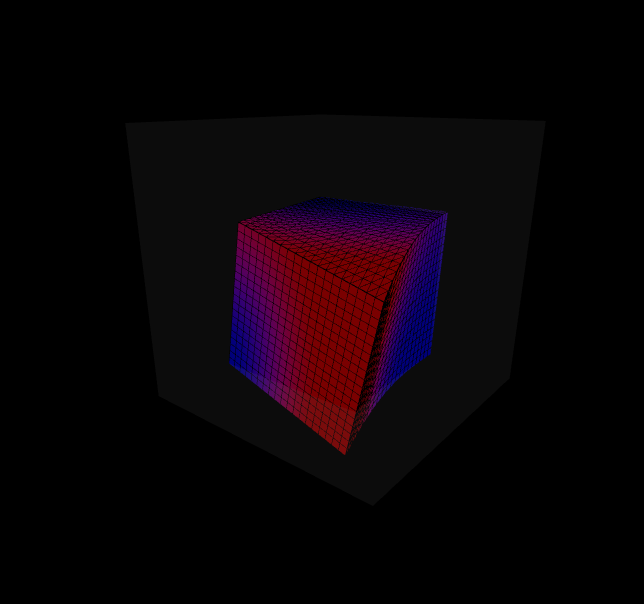
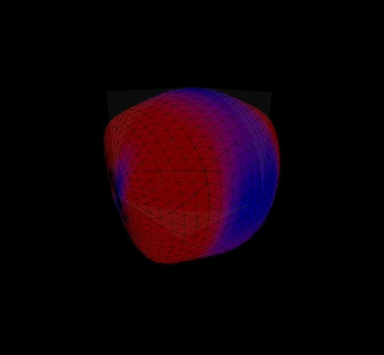
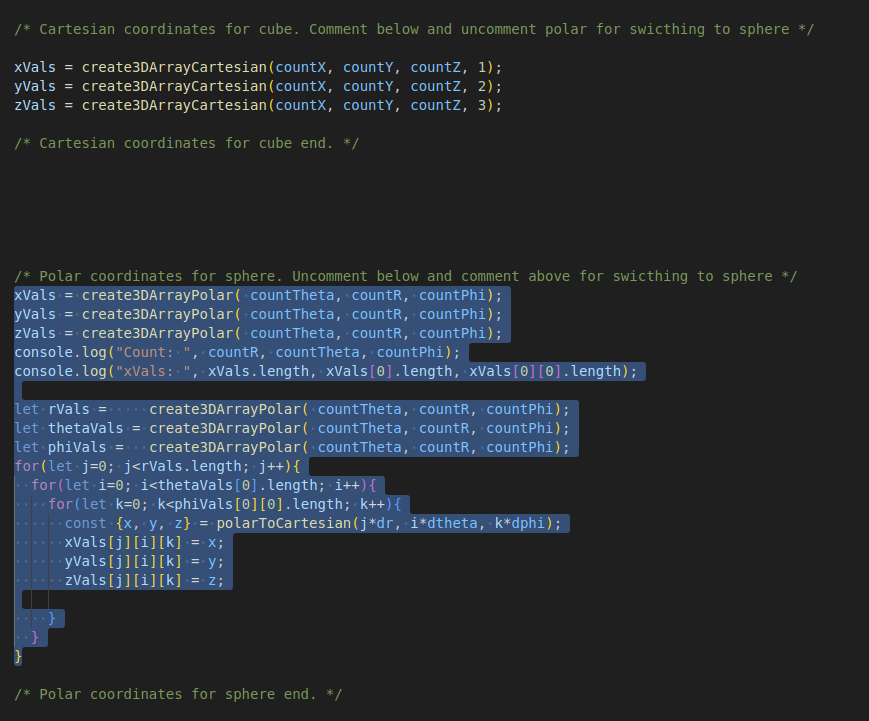

# Displacement visualizer

This project is techincally still far from being useful, but it's a proof of concept that Javascript is pretty OP.

After all, Any application that can be written in JavaScript, will eventually be written in JavaScript.

## Demo:
Try the demo here, hosted on github pages: [https://sam-martis.github.io/Stress-Strain_Basic/](https://sam-martis.github.io/Stress-Strain_Basic/)

You can use your mouse to interact with the site!

The following displacement function is used:

To switch meshes, comment out the selected portion of code as shown in the image:
